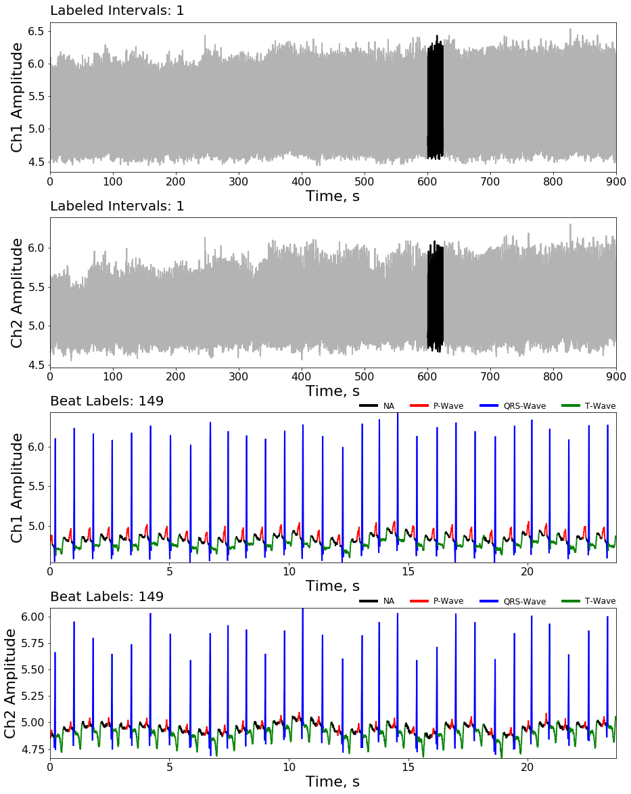

# KardioNet
Automatic ECG segmentation using deep learning.

### The QT Database
The [QT Database](https://physionet.org/physiobank/database/qtdb/) includes ECGs which were chosen to represent a wide 
variety of QRS and ST-T morphologies, in order to challenge QT detection algorithms with real-world variability. The QT 
Database contains a total of 105 fifteen-minute excerpts of two channel ECGs, selected to avoid significant baseline 
wander or other artifacts. 

#### [Download Link](https://www.physionet.org/physiobank/database/qtdb/)

#### Label Example

## License
[MIT](LICENSE.txt)

## References
1. Goldberger AL, Amaral LAN, Glass L, Hausdorff JM, Ivanov PCh, Mark RG, Mietus JE, Moody GB, Peng C-K, Stanley HE. 
PhysioBank, PhysioToolkit, and PhysioNet: Components of a New Research Resource for Complex Physiologic Signals. 
Circulation 101(23):e215-e220 (http://circ.ahajournals.org/content/101/23/e215.full); 
2000 (June 13).